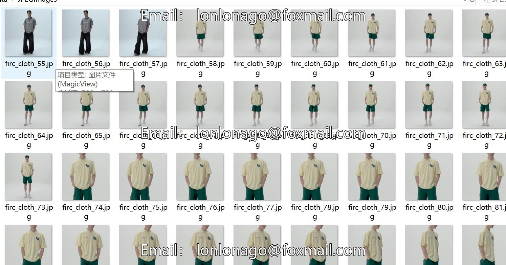
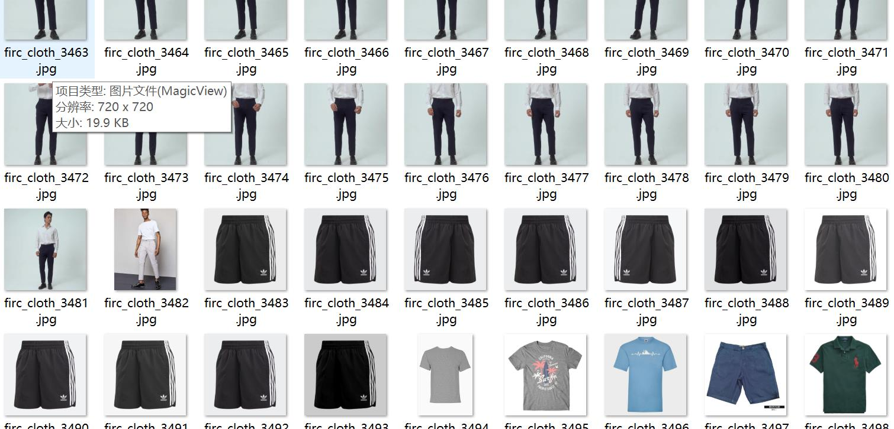
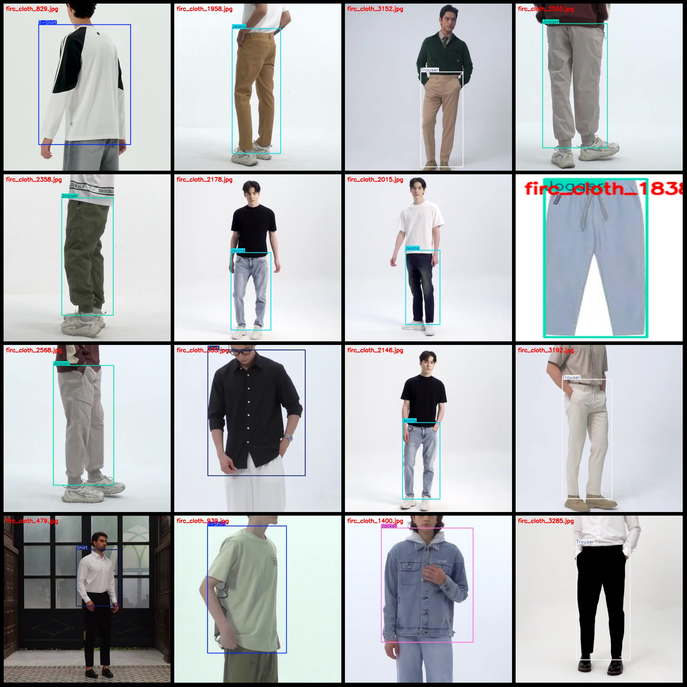
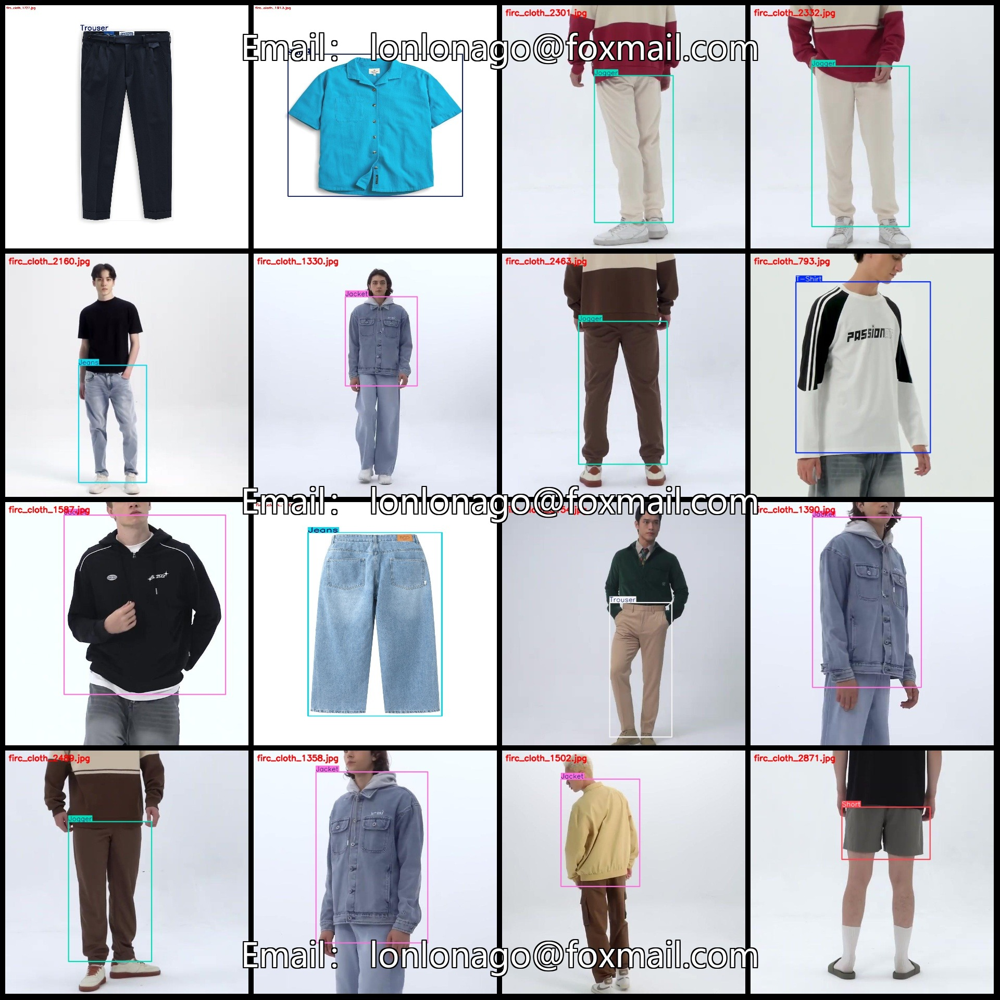

# Fashion Category Identification Detection Dataset VOC + YOLO Format with 3698 Images and 8 Categories

Dataset format: Pascal VOC format+YOLO format (without split path in txtfile, only contain jpgimage and corresponding VOC format xmlfile and yolo format txtfile)
number of images: 3698  
annotation count: 3698  
annotation count: 3698  
annotationnumber of classes: 8  
["Jacket", "Jeans", "Jogger", "Polo", "Shirt", "Short", "T-Shirt", "Trouser"]
boxes per class:   
The jacket box count is 464.
Jeans box count = 420
Jogger box count = 459
Polo box count = 501
Shirt box count = 485
Short box count = 461
T-Shirt box count = 461
Trouser box count = 447
total boxes: 3698  
images per class:   
The number 464 is a prime number.
Jeans images = 420
Jogger images are a popular style of clothing for those who enjoy running or jogging. These images typically feature athletic wear, such as shorts and tank tops, along with supportive leggings or tights. They may also include accessories like sports bands, headbands, or wristbands to help keep track of pace or distance. Jogger images are often used in fitness and health-related content, as well as fashion and lifestyle magazines.
Polo images = 501  
Shirt images = 485  
Short images = 461  
T-shirt images = 461
The image of a trouser is 447.
image resolution: 720x720  
Use annotation tool: labelImg
Annotation rules: Draw a rectangle around the class.
Important notes: The dataset does not have a separate training, validation, or test set; it needs to be split manually.
Special statement: This dataset does not guarantee the accuracy of any models trained on it or the weights file.
Image preview:
## Images

Here is a pay link on Stripe ( https://buy.stripe.com/3cs8yP7sY87d0vu9AB ). Please contact me lonlonago@foxmail.com after funding $89, and I will send you a complete data files , thank you!

